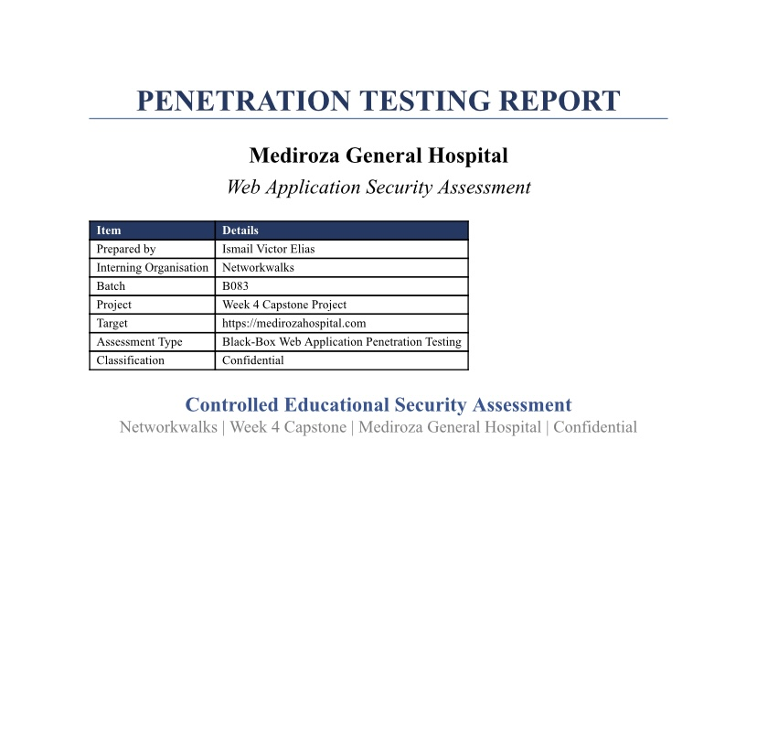
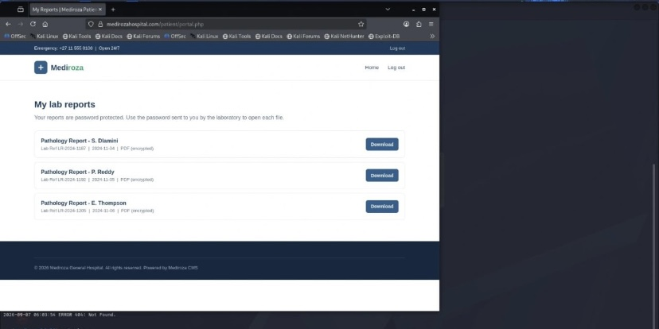
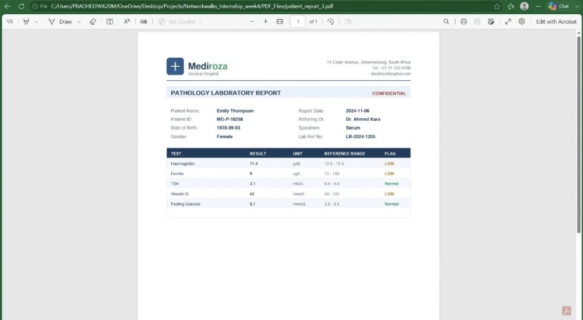
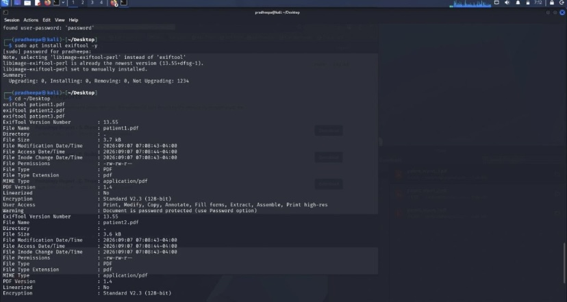
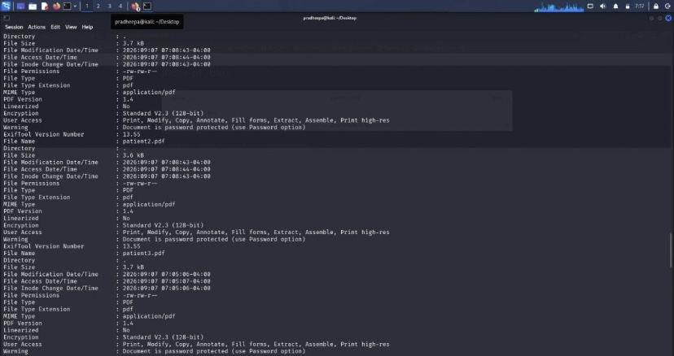

🔐 NETWORKWALKS B083 — WEEK 4 CAPSTONE
Mediroza General Hospital — Penetration Testing Report
Client: Mediroza General Hospital
Target: https://medirozahospital.com
Assessment Type: Black-Box Web Application Penetration Test
Duration: 5 Days
Project: Networkwalks B083 — Week 4
Tester: Ismail Victor Elias
Classification: Networkwalks Confidential — Authorised Personnel Only


⸻


01. Executive Summary
This report documents a black-box web application security assessment performed against the Mediroza General Hospital web application as part of the Networkwalks B083 Week 4 Capstone Project.
The assessment was conducted within the authorized Networkwalks educational environment. The objective was to investigate the application’s exposed functionality, assess access controls, retrieve the confidential laboratory reports specified by the project, and examine the security properties of the recovered PDF documents.
During the assessment, the Mediroza application and its authentication interface were identified. Access to the patient-report area was demonstrated, where three encrypted laboratory reports were displayed. The retrieved documents were subsequently examined using PDF analysis and metadata-analysis techniques.
The available evidence demonstrates issues relating to restricted report access and document protection/metadata exposure. Further findings are limited to what can be supported by the evidence supplied with this report.


⸻


02. Scope and Methodology
Target
https://medirozahospital.com
Assessment Type
Black-box web application penetration testing.
Scope
The assessment focused on:
* Web application reconnaissance
* Authentication interfaces
* Patient portal functionality
* Access to laboratory reports
* PDF protection
* PDF metadata and document-property analysis
Tools Observed in the Evidence
* Web browser
* Gobuster
* ExifTool
* PDF reader
* Linux/Kali environment
Testing was conducted within the authorized educational environment specified by Networkwalks.


⸻


03. Milestone 1 — Initial Access
Application and Login Interface
During reconnaissance, the Mediroza General Hospital web application and its staff login functionality were identified.
Figure 1 — Mediroza General Hospital staff login interface identified during reconnaissance.

The interface provides a Staff ID and Password field and indicates that the functionality is intended for internal staff access.


⸻


Patient Report Portal
The patient-report functionality was subsequently identified.
The portal displayed three laboratory reports:
* Pathology Report — S. Dlamini
* Pathology Report — P. Reddy
* Pathology Report — E. Thompson
The reports were marked as PDF documents with encryption.
Figure 2 — Patient portal displaying three protected laboratory reports.

Observation
The ability to reach the patient-report interface and identify multiple confidential laboratory reports demonstrates the importance of enforcing appropriate authentication and authorization controls around sensitive medical documents.
Security Impact
Unauthorized access to patient reports could potentially expose confidential medical information and create privacy and regulatory risks.
Recommendation
* Enforce server-side authorization for every patient document.
* Verify that the requesting user is authorized to access the specific report.
* Keep sensitive documents outside publicly accessible locations.
* Do not rely solely on PDF encryption to protect confidential information.


⸻


04. Milestone 2 — PDF Security Analysis
Recovered Laboratory Report
The supplied evidence shows a laboratory report being successfully opened and viewed.
Figure 3 — Recovered Mediroza pathology laboratory report.

The document contains sensitive medical information including patient details, report information, referring doctor information, laboratory information, and test results.
Security Impact
Medical laboratory reports contain highly sensitive information and therefore require strong access-control and confidentiality protections.
Recommendation
* Restrict access to authenticated and authorized users.
* Apply appropriate document protection.
* Prevent direct unauthorized access to report files.
* Avoid exposing sensitive medical documents through predictable URLs or publicly accessible directories.


⸻


05. PDF Encryption and Metadata Analysis
The supplied terminal evidence demonstrates the use of ExifTool to inspect the recovered PDF files.
The analysis displayed information including:
* PDF file name
* File size
* File type
* PDF version
* permissions
* encryption status
* user access permissions
* password-protection warnings
Figure 4 — ExifTool analysis of recovered PDF documents.

Figure 5 — Additional PDF encryption and document-property analysis.

Finding — Sensitive PDF Metadata / Document Information Exposure
Severity: Medium
The PDF analysis demonstrated that document properties and security information could be examined using metadata-analysis tools.
Depending on the information contained within the metadata, such information may provide useful reconnaissance information to an attacker.
Potential Impact
Metadata can potentially expose:
* Author information
* Document properties
* Internal information
* File creation/modification information
* Security configuration details
Recommendation
* Remove unnecessary metadata before distributing documents.
* Review sensitive documents before publication.
* Remove internal comments and unnecessary author information.
* Establish a document-sanitization process.


⸻


06. Findings Summary
Based only on the supplied evidence, the following observations can be documented:
#	Finding	Severity
1	Sensitive patient-report access	High
2	PDF protection/security exposure	High
3	PDF metadata/document information exposure	Medium

Note: SQL injection, username enumeration, exposed database backups, employee salaries, and shareholder information are not included as confirmed findings in this version, because the screenshots supplied here do not provide direct evidence for those findings.

⸻

07. Attack / Assessment Flow

Based on the supplied evidence:

Web Application Reconnaissance
          ↓
Identify Authentication Interface
          ↓
Identify Patient Report Functionality
          ↓
Access Laboratory Reports
          ↓
Retrieve Protected PDF Documents
          ↓
Analyze PDF Protection
          ↓
Analyze PDF Metadata
          ↓
Document Security Findings

08. Recommendations and Remediation
Authentication & Authorization
* Implement strong authentication controls.
* Enforce authorization on every sensitive resource.
* Verify access permissions before serving patient reports.
* Avoid exposing sensitive documents directly.
Patient Documents
* Store reports securely outside public web directories.
* Apply appropriate access controls.
* Use strong document-protection mechanisms.
* Prevent unauthorized direct access to document URLs.
PDF Metadata
* Remove unnecessary metadata.
* Remove internal comments and author information where appropriate.
* Review documents before publication or external distribution.
General Security
* Regularly perform vulnerability assessments.
* Monitor access to sensitive resources.
* Maintain secure server configurations.
* Apply least-privilege access controls.


⸻


09. Conclusion
The Networkwalks B083 Week 4 assessment demonstrated the importance of protecting sensitive healthcare information throughout the application and document lifecycle.
The supplied evidence demonstrates access to the patient-report functionality, retrieval and examination of protected laboratory reports, and analysis of PDF security properties and metadata.
Because the assessment involved sensitive medical information, strong authentication, authorization, secure document storage, encryption, and metadata sanitization are important controls for reducing the risk of unauthorized disclosure.
All testing described in this report was performed within the authorized Networkwalks educational environment.


⸻


👨🏽‍💻 Author
Ismail Victor Elias
Cybersecurity Learner | Penetration Testing & Security Enthusiast
Networkwalks B083 — Week 4 Capstone
Target: https://medirozahospital.com
Classification: Networkwalks Confidential — Authorised Personnel Only
